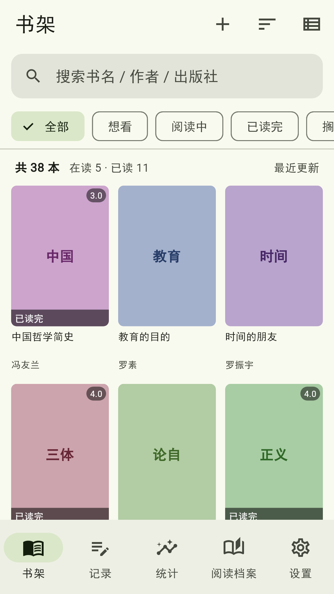
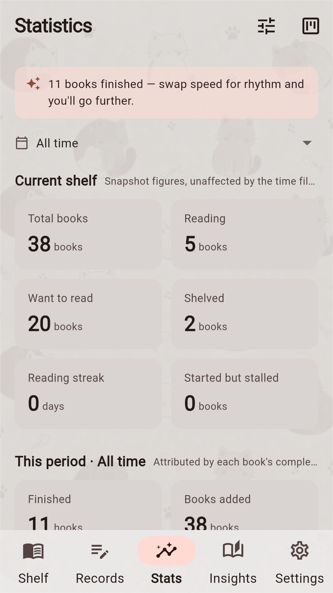
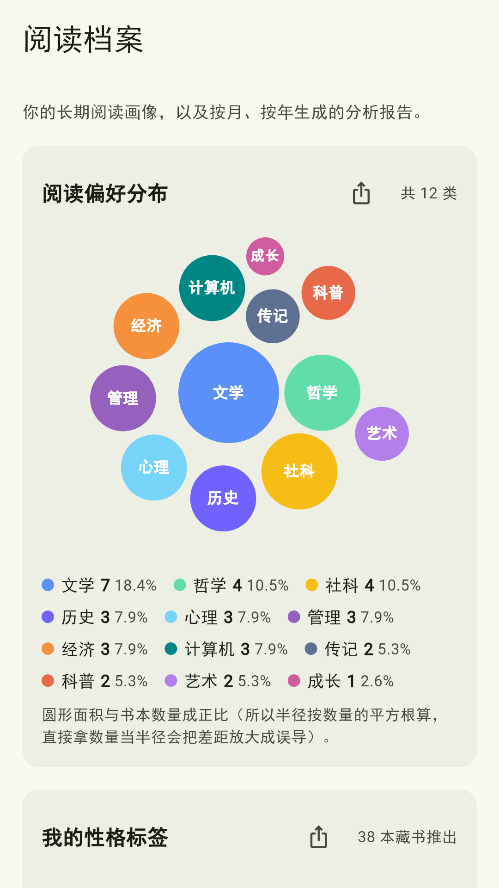
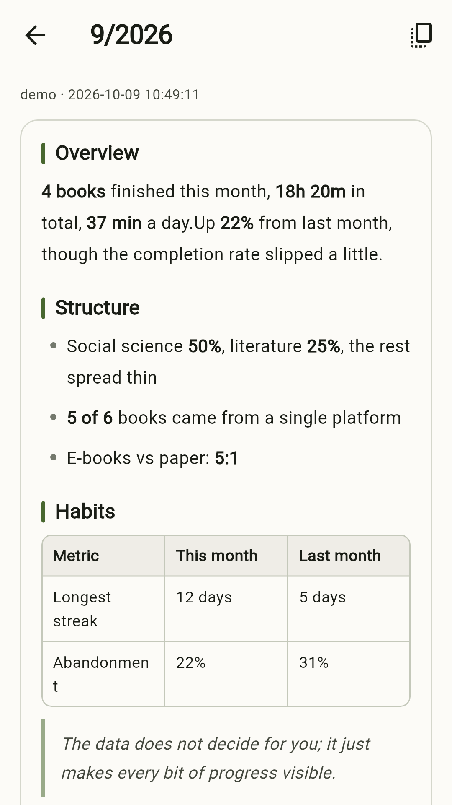
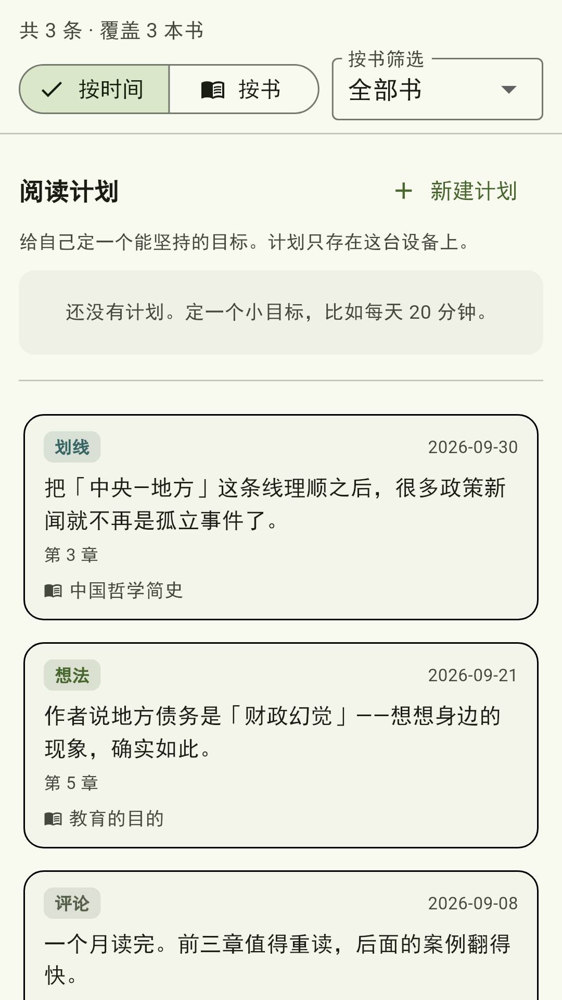

# Readnest

<p align="center">
  
</p>

<p align="center">
  <strong>Readnest</strong> is a quiet, private, local-first reading log for books, notes, reading plans, and the small reflections that come with them.
</p>

<p align="center">
  <a href="https://kjlintong.github.io/readnest.html">Product page</a> ·
  <a href="https://github.com/kjlintong/reading-tracker/releases">Releases</a> ·
  <a href="docs/07-Privacy-Policy%28EN%29.md">Privacy policy</a> ·
  <a href="LICENSE">MIT license</a>
</p>

Your books, notes, and reading plans stay on your phone in a SQLite database. There is no Readnest account, no Readnest backend, and no cloud sync.

## Screens

| Bookshelf | Statistics | Reading profile |
|---|---|---|
|  |  |  |

| AI reading report | Notes and plans |
|---|---|
|  |  |

## What Readnest does

- **Bring books in from many places** — add books manually, scan a bookshelf photo or screenshot, import from WeRead, Goodreads, Notion, CSV, Open Library, or Google Books.
- **Keep one clean shelf** — every source is normalized into the same `Book` model. Fields Readnest does not store explicitly are preserved in `extra` metadata.
- **Merge duplicates carefully** — ISBN is used when available; otherwise title plus first author is used. Missing fields are filled in, but user-entered ratings, summaries, and notes are not overwritten.
- **Normalize categories** — platform-specific shelf names are mapped into a controlled category vocabulary so the same reading area does not split across statistics. Categories can be renamed, removed, or extended.
- **Keep daily reading sustainable** — daily plans repeat until the whole plan is finished. Reminders are local notifications.
- **Look back honestly** — charts cover reading status, categories, monthly trends, ratings, progress, and source platforms. Readnest does not invent reading time or streak data it cannot measure.
- **Make reading your own** — create a reading profile with preference bubbles and personality tags, then export or share it as an image.
- **Optional AI reports** — when enabled, Readnest sends aggregate local statistics to a model you configure. It does not send book titles or note text.
- **Work offline** — core reading features do not require an account or network. OCR runs on-device through ML Kit.
- **Multiple languages and themes** — Chinese, English, German, French, and Spanish are supported, with light/dark mode following the system setting.

## Download

The latest Android APK is available in [GitHub Releases](https://github.com/kjlintong/reading-tracker/releases).

> iOS is not yet published on the App Store. The source is ready for a signed iOS build if you have the required Apple and macOS/Codemagic setup.

## Repository layout

```text
app/                Flutter client; local-first and backend-free
├── lib/
│   ├── models/     Book, ReadingLog, Note, ReadingPlan, enums, categories
│   ├── data/       SQLite schema, repositories, statistics aggregation
│   ├── import/     CSV, OCR text, bookshelf photo parsing, fallback enrichment
│   ├── ai/         OpenAI-compatible and Anthropic-style AI clients
│   ├── services/   local notifications, export/share helpers
│   └── ui/         shelf, notes, stats, profile, settings screens
├── test/           logic, widget, golden, and store screenshot tests
├── assets/seed/    sample reading data
└── tool/checks/    pure Dart validation scripts

store/              app store assets: screenshots, icons, listing copy
tools/              Node data tools for CSV parsing and report preparation
scripts/            environment checks, screenshot, and release helpers
docs/               technical notes, data-source notes, privacy policy, release docs
```

## Build from source

Requirements:

- Flutter 3.24.x / Dart 3.5.x
- Android SDK 34

```bash
git clone https://github.com/kjlintong/reading-tracker.git
cd reading-tracker/app
flutter pub get
flutter run                         # run on a device or emulator
flutter build apk --release         # build the Android APK
```

The first time you run widget or golden tests, Chinese text may need a local CJK font fixture:

```bash
cp /mnt/c/Windows/Fonts/simhei.ttf test/fixtures/     # Windows/WSL example
cp ~/dev/flutter/bin/cache/artifacts/material_fonts/MaterialIcons-Regular.otf test/fixtures/
```

For Linux/WSL desktop debugging, install the usual GTK and build dependencies such as `clang`, `cmake`, `ninja-build`, `pkg-config`, `libgtk-3-dev`, and `liblzma-dev`. `google_mlkit_text_recognition` and `image_picker` are Android/iOS plugins, so Linux builds may skip or warn about them.

## Tests

```bash
cd app && flutter test                              # Flutter logic, widget, and golden tests
cd tools && node test/smoke.mjs                     # CSV parsing and enrichment fallback tests
cd tools && node test/category.test.mjs             # category normalization tests
cd app && dart run tool/checks/seed_check.dart      # seed data integrity check
cd app && dart run tool/checks/category_check.dart  # controlled vocabulary check
```

Generate app store screenshots using Flutter’s software renderer:

```bash
STORE_SHOTS=1 flutter test test/store_screenshots_test.dart
```

## Optional configuration

```bash
cd tools && cp .env.example .env
```

Useful variables:

- `WEREAD_API_KEY` — `wrk-` key from <https://weread.qq.com/r/weread-skills>, used for WeRead import.
- `LLM_API_KEY`, `LLM_BASE_URL`, `LLM_MODEL` — OpenAI-compatible model settings used for metadata fallback and AI report generation.

These are optional. Leave them unset if you do not need WeRead import or AI report generation.

## Privacy

Readnest is local-first:

- Reading data lives only on the user’s device.
- OCR is performed on-device.
- Optional AI reports send aggregate statistics, not book titles or note text.
- LLM keys are supplied by the user and used against the endpoint the user chooses.

See the [English privacy policy](docs/07-Privacy-Policy%28EN%29.md) for the full statement.

## Supporting Readnest

Readnest is free and ad-free. If it helps you keep your reading life, you can support continued development through:

- <https://afdian.com/a/ryanlintong>
- <https://ko-fi.com/ryanlin65969>

## License

[MIT](LICENSE)
