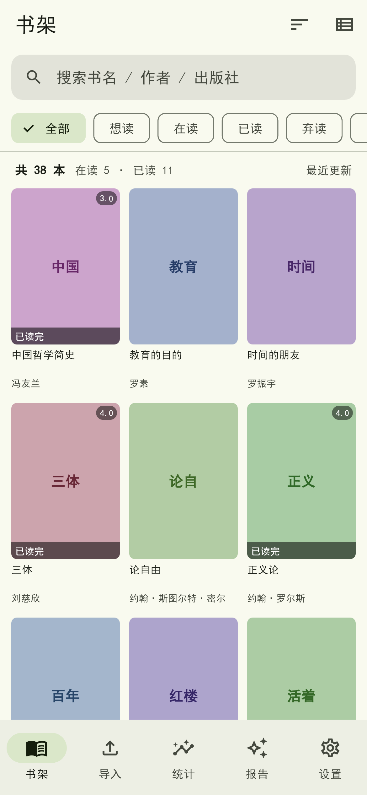
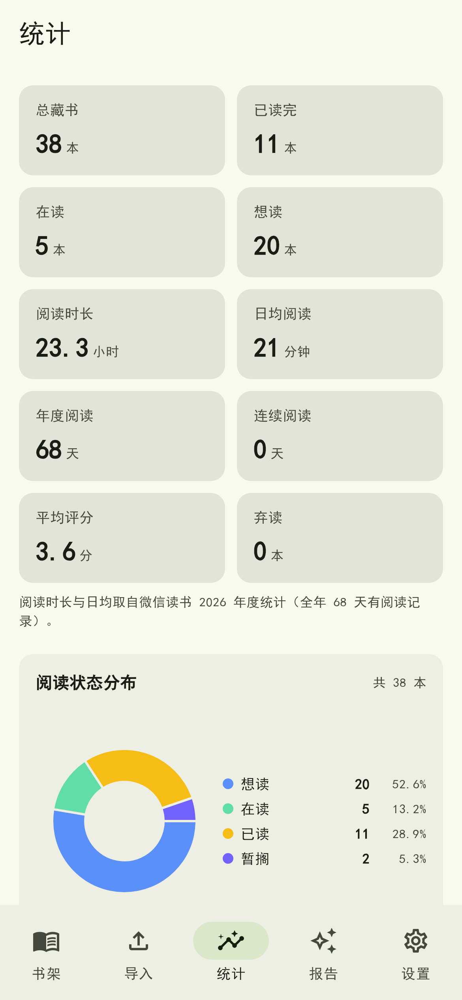

# reading-tracker

个人阅读管理 App。核心思路是**本地优先**：所有数据存在手机本地 SQLite 里，没有账号、没有服务器、没有云同步。

首次启动自动灌入 38 本示例书，打开就是形态完整的书架、统计和笔记，而不是空列表；再用自己的数据源（微信读书、Notion 导出、CSV、拍照 OCR）导入真实书单即可。




## 功能

- **多来源导入**：微信读书官方 Agent 网关、Notion 数据库导出（Markdown/CSV）、通用 CSV、书架照片 OCR（ML Kit 端侧离线识别，中英文）、手动录入
- **统一数据模型**：所有导入源先转成同一个 `Book` 结构，`extra` 兜底保存源系统自定义字段，迁移零丢失
- **多源合并去重**：ISBN 优先、书名+首位作者兜底；字段只补空缺，绝不覆盖你手填的评分与摘要
- **分类归一化**：60 条别名映射把微信读书自有分类（经济理财 / 个人成长 / 哲学宗教…）统一收敛到 14 类受控词表，同一语义不会在统计里分裂成两个标签
- **阅读统计**：分类分布、月度读完趋势、月度阅读时长、评分分布、在读进度、来源平台占比
- **微信读书年度统计**：逐月时长、阅读天数、日均阅读自动接进统计页
- **AI 阅读报告**：把本地算好的结构化统计交给大模型解读，模型不碰原文，也不会编造数字
- **端侧 OCR 导入**：书架照片 → 图像增强 → ML Kit 文字识别 → 书名解析，全程离线

## 架构

```
app/                Flutter 客户端（本地优先，无后端）
├── lib/
│   ├── models/     Book / ReadingLog / Note + 枚举与分类归一化（跨端契约）
│   ├── data/       SQLite schema、仓储层、种子导入、年度统计解析
│   ├── import/     多源导入：CSV / OCR 行解析 / 书架版面检测 / LLM 兜底
│   ├── ai/         OpenAI 兼容 + Anthropic 两种协议的统一客户端
│   └── ui/         书架 / 导入 / 统计 / 报告 / 设置（Riverpod 状态管理）
├── test/           167 项测试（逻辑 + widget + 截图基准）
├── assets/seed/    示例书库（合成数据，见下）
└── tool/checks/    纯 Dart 校验脚本，不依赖 Flutter 插件

tools/              Node 数据工具链（离线预处理与报告生成）
├── notion-import.mjs    Notion 导出 → 统一模型
├── weread-sync.mjs      微信读书书架 / 进度 / 统计
├── merge.mjs            多源合并去重
├── enrich.mjs           权威源补全（微信读书 → Google Books → Open Library）
├── llm-enrich.mjs       大模型批量兜底补全
├── fill-authors.mjs     作者补全（宁缺勿编）
├── report.mjs           定期阅读报告
├── gen-sample-library.py 生成示例书库
└── lib/           跨端数据契约 schema + provider 实现

scripts/            wsl-bootstrap / verify_wsl / screenshot / wsl-android-setup / build-apk
docs/               技术方案、数据接入实测记录、阅读报告、开发环境指南
```

数据流：`导入源 → tools/ 预处理（可选）→ assets/seed/library.json → SeedImporter → SQLite`。App 运行期只做本地读写与按需导入，不依赖 `tools/`。

## 示例数据与隐私

`app/assets/seed/library.json` 是**合成数据**，不是任何人的真实书单。生成脚本在 `tools/gen-sample-library.py`：书目元数据（书名 / 作者 / 分类 / 简介）来自公开出版物信息，阅读行为字段（状态、进度、评分、起止日期、阅读时长）全部重新编造。

之所以不用真实数据：仓库是公开的，真实书单里的阅读偏好、私人书签页码、平台内部 bookId 与 deepLink 都能反查出某个具体的人。`app/test/seed_test.dart` 里有一组「种子数据脱敏」断言，保证 `coverUrl` / `sourceBookId` / `sourceUrl` 全为空、id 带 `sample-` 前缀、无私密书籍与私人借阅记录。

同类原则也约束了 `.gitignore`：真实 Notion 导出、真实微信读书拉取结果、`.env`、测试截图失败现场一律不入库。密钥只有模板 `tools/.env.example`，两个 Key 都是可选的（缺省时对应的导入与 AI 功能不可用，其余功能正常）。

## 环境要求

- Flutter 3.24.5（Dart 3.5.4）
- Android SDK（`compileSdk 34`）
- Node.js ≥ 18（仅 `tools/` 需要，App 运行不依赖）

## 快速开始

```bash
cd app
flutter pub get

# 日常验证：静态检查 + 全量测试 + 资源打包
bash ../scripts/verify_wsl.sh

# 首次跑测试需要中文字体（否则界面上中文全是空白方块）
cp /mnt/c/Windows/Fonts/simhei.ttf test/fixtures/     # Windows 侧
cp ~/dev/flutter/bin/cache/artifacts/material_fonts/MaterialIcons-Regular.otf test/fixtures/
```

跑起来：

```bash
cd app
flutter run                          # 真机 / 模拟器
flutter build apk --release          # 或出包
```

Linux / WSL 桌面调试需要 GTK 开发库（`clang cmake ninja-build pkg-config libgtk-3-dev liblzma-dev`）；注意 `google_mlkit_text_recognition` 与 `image_picker` 不支持 Linux，构建时会告警跳过。

生成界面截图（免真机、免显示器、免 sudo，走 flutter_test 的 Skia 软件渲染）：

```bash
bash scripts/screenshot.sh           # 产物：app/test/goldens/*.png
```

## 重新生成示例书库

```bash
python3 tools/gen-sample-library.py  # 确定性随机种子，重跑产出字节一致
```

脚本自带校验：分类不少于 12 类且每类至少 1 本（保证统计图表不会退化成一根柱子）、笔记必须能按书名+作者关联到书。

## 配置密钥（可选）

```bash
cd tools && cp .env.example .env
```

- `WEREAD_API_KEY`：扫码 https://weread.qq.com/r/weread-skills 获取（`wrk-` 开头），用于微信读书导入
- `LLM_API_KEY` / `LLM_BASE_URL` / `LLM_MODEL`：OpenAI 兼容协议的大模型，用于元数据兜底补全与 AI 报告

两者都留空也能用，只是对应的两条链路不可用。Key 等同身份凭证，建议定期重新生成替换。

## 测试

```bash
cd app && flutter test                 # 167 项，全部通过
cd tools && node test/smoke.mjs        # 28 项，CSV/解析/补全降级
cd tools && node test/category.test.mjs  # 22 项，分类归一化
cd app  && dart run tool/checks/seed_check.dart   # 种子数据完整性
cd app  && dart run tool/checks/category_check.dart # 分类词表校验
```

## 文档

- [01 技术方案](docs/01-技术方案.md) — 数据模型、多源导入、分类归一化设计
- [02 数据接入与实测记录](docs/02-数据接入与实测记录.md) — 各数据源接入实测与踩坑
- [03 阅读报告-2026](docs/03-阅读报告-2026.md) — 基于真实数据的年度报告样例
- [04 WSL 开发环境与继续开发指南](docs/04-WSL开发环境与继续开发指南.md) — 环境搭建、脚本分工、已知坑位

## License

MIT
